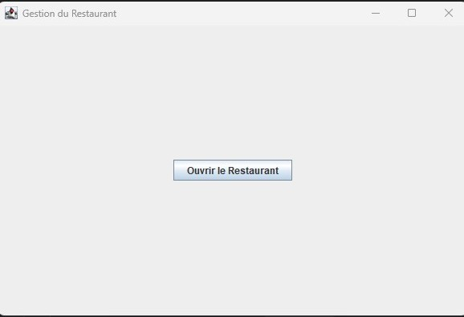
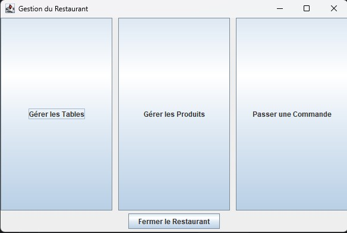

# Management du Restaurant

## Description
Ce projet propose une interface fluide pour la gestion d'un restaurant.
Il permet à l'utilisateur de pouvoir ajouter, supprimer, mettre à jour l'ensemble des : tables, produits (indépendants et menus) et commandes.

## Aperçu de l'application
 

> Les images ci-dessus montrent l'interface du restaurant lorsqu'il est fermé et ouvert.

## Fonctionnalités 
- Interface intuitive en Java (Swing)
- Gestion des tables, des produits afin de :
  - supprimer
  - mettre à jour
  - créer
  - lire l'ensemble
- Résultat affiché en temps réel

## Fonctionnalités à développer
- pouvoir passer, créer, supprimer et mettre à jour les commandes
- Pouvoir fusionner deux tables pour une réservation d'un groupe et la dissocier lors d'un paiement
- La gestion des factures.

## Défis rencontrés
- Gérer un système permettant d'ajouter ou modifier les menus en fonction des produits.
- Comprendre pourquoi faire en MVC
- Faire différentes GUI pour représenter les étapes de gestion (ex: RestaurantManagementGUI pour l'affichage général, puis des interfaces indépendantes pour chaque sous-gestion).

## Technologies utilisées

  
  
  

