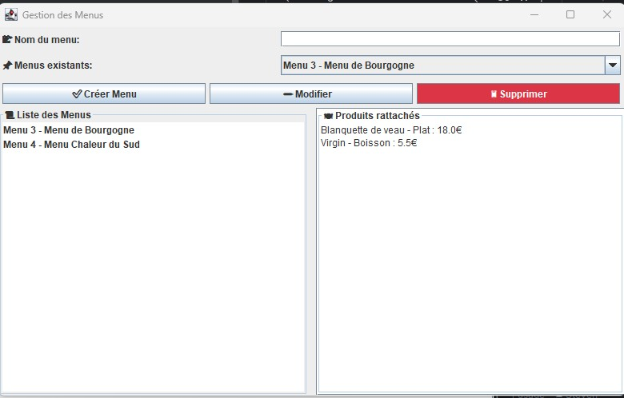

# Gestion du Restaurant

## Description
Ce projet propose une interface fluide pour la gestion d'un restaurant.
Il permet à l'utilisateur d'ajouter, de supprimer et de mettre à jour l'ensemble des : tables, produits (indépendants et menus) et commandes.

## Aperçu de l'application
 

> Les images ci-dessus montrent l'interface du restaurant lorsqu'il est fermé, ouvert, et lors de la gestion des menus.

## Fonctionnalités 
- Interface intuitive en Java (Swing)
- Gestion complète des tables et des produits :
  - Création.
  - Suppression.
  - Mise à jour.
  - Visualisation.
- Affichage du résultat en temps réel.

## Fonctionnalités à développer
- Passer, modifier et supprimer des commandes.
- Fusionner deux tables pour un groupe et les dissocier au moment du paiement.
- Mettre en place une gestion des factures.

## Défis rencontrés
- Mettre en place un système de menus dépendant des produits disponibles.
- Comprendre et appliquer le modèle MVC, qui a permis de bien séparer la logique métier, l'affichage et les interactions utilisateur pour une meilleure gestion du code et une évolution facilitée du projet.
- Créer plusieurs interfaces graphiques en fonction des modules (par exemple : RestaurantManagementGUI pour l’interface générale, puis des interfaces spécifiques pour chaque gestion).

## Technologies utilisées

  
  
  

